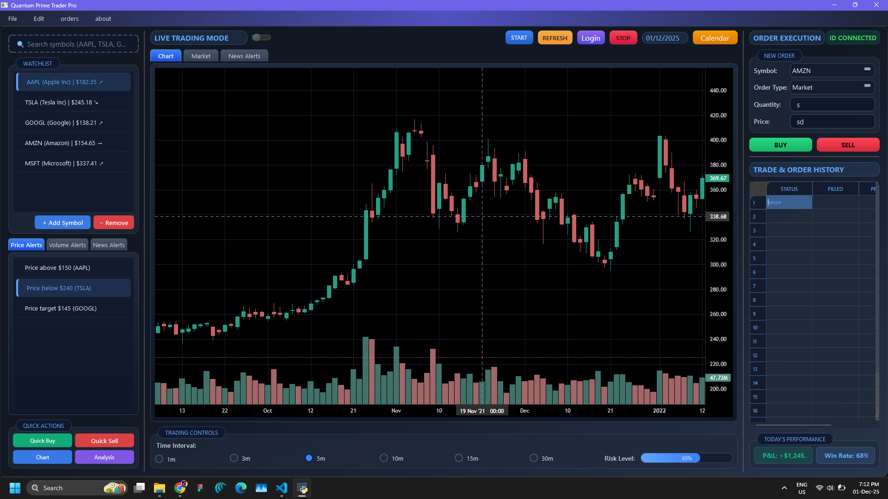

!Development in process...

# Stock-Trading-Automation-App-Using-Transformer-Model
Stock-Trading-Automation-App-Using-Transformer-Model is a comprehensive, Python-based application that combines advanced time-series forecasting via Transformer neural networks with an intuitive GUI for trading, analysis, and automation. Designed for developers, quant traders, and data-enthusiasts

Project Snapshot:

🚀 Stock-Trading-Automation-App-Using-Transformer-Model

AI-Powered Trading & Forecasting Desktop Application
Built with Python, TensorFlow/Keras (Transformer), PyQt6, Lightweight-Charts

📌 Concept & Overview

Stock-Trading-Automation-App-Using-Transformer-Model is a desktop-based trading analysis and automation platform leveraging Transformer deep learning models for stock trend prediction. It integrates real-time technical charting, trade monitoring, and AI-based forecasting into a modern GUI built using PyQt6 and Lightweight Charts.

This project demonstrates end-to-end implementation of data ingestion → ML prediction → decision support → trading interface, making it ideal for quant developers, AI researchers, algorithmic traders, and financial engineers.

✨ Key Features

Feature	Description

📊 Interactive Trading Dashboard	Built using PyQt6 + Lightweight Charts

🤖 AI Prediction Engine (Transformer)	Predicts stock price movement or return

⚙️ Automated Trading Signals	Generates Buy/Sell recommendations

📈 Real-time Chart Rendering	Candlestick + Volume chart with zoom/pan

🔔 Custom Price Alerts	Price, Volume, and News-based triggers

🔍 Risk & Performance Metrics	Win Rate %, P&L tracking, Risk Exposure

💾 Local Data Storage	Model logs, chart configurations, history

🧩 Modular ML Pipeline	Easy to switch between models (LSTM/GRU/Transformer)

🔐 Supports API Integration	Ready to integrate with broker SDKs

🧠 Tech Stack
Category	Technologies
UI Framework	PyQt6
Charting	Lightweight Charts (via Python wrappers)
AI/ML	TensorFlow, Keras
Model	Transformer (Time-Series based)
Programming Language	Python
Data Processing	Pandas, NumPy
